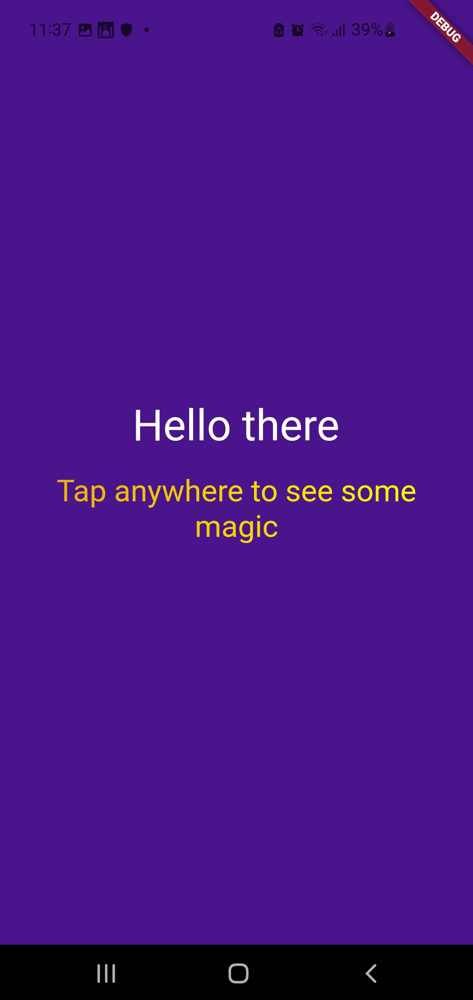

# magic_bg
[](https://pub.dev/packages/solid_lints)

Having a bad day , check out flutter magic_bg app to ligthen app your mood, if the magical color  changes and effects 😮  on the app doesnt do the trick  , then i dont know what would





This is a simple Flutter app that changes the background color when the user taps on the screen. It is built using the Flutter framework and can be easily run on both iOS and Android devices.


## Installation
To run the app, follow these steps:

Make sure you have Flutter installed on your computer. If you don't have Flutter installed, follow the instructions in the [Flutter documentation](https://flutter.dev/docs/get-started/install).

Clone this repository to your computer.

Bash
```
git clone https://github.com/your-username/flutter-background-color-changer.git`

```
Open the cloned directory in your preferred IDE or editor.

Run the app using the following command:

```
flutter run 
```

## Architecture

*Based on Robert C Martin (Uncle Bobs) clean architecure concepts*  

**Most of this application logic is to update the state of the background color, this can be ideally implemented on the  presentation layer**  


